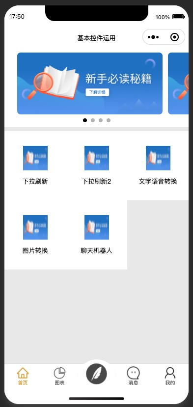
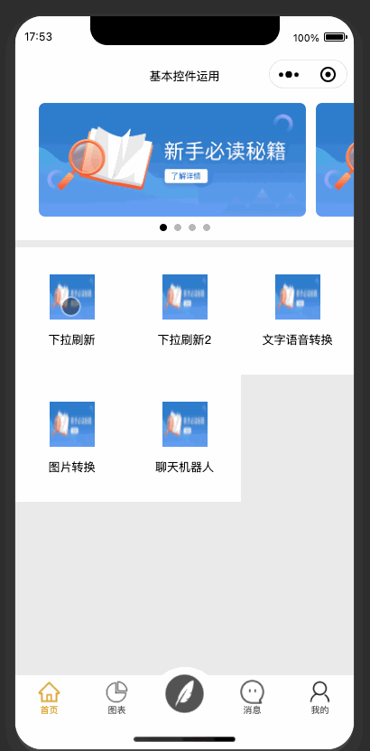
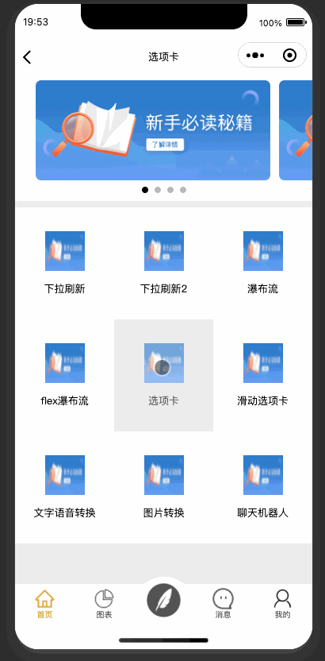
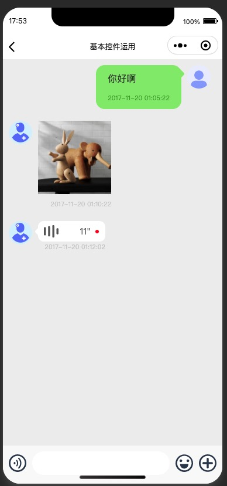

# wechat-components
微信小程序，自定义tabar，下拉刷新和上拉加载，聊天页面，九宫格，轮播图，

> 最近自己在学习微信小程序，所以就把学习的结果集合到一起，方便使用。

## 首页使用自定义tabar凸起、轮播图和九宫格布局

## 下拉刷新和上拉加载

## 选项卡，头部导航

## 聊天页面

> 声明：参考好多大神的demo，用了其中一些大神的代码
> 感谢 ：
> [wx_scroll-view](https://github.com/hedy-6/wx_scroll-view)
> 自定义底部tabba凸起 nj_tabbar 中间凸起的tabbar [小程序代码片段](https://developers.weixin.qq.com/s/X5YzxJmf7mjW)
> 当然还其他大神的，感谢！！